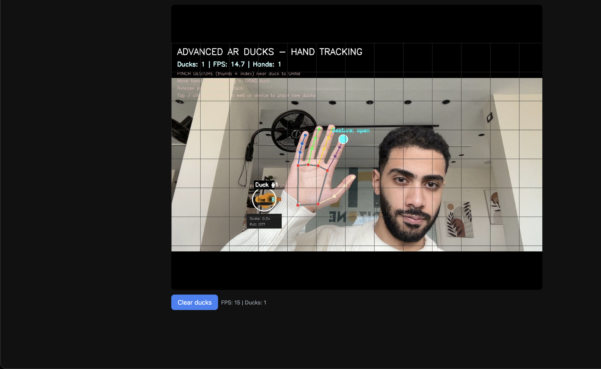
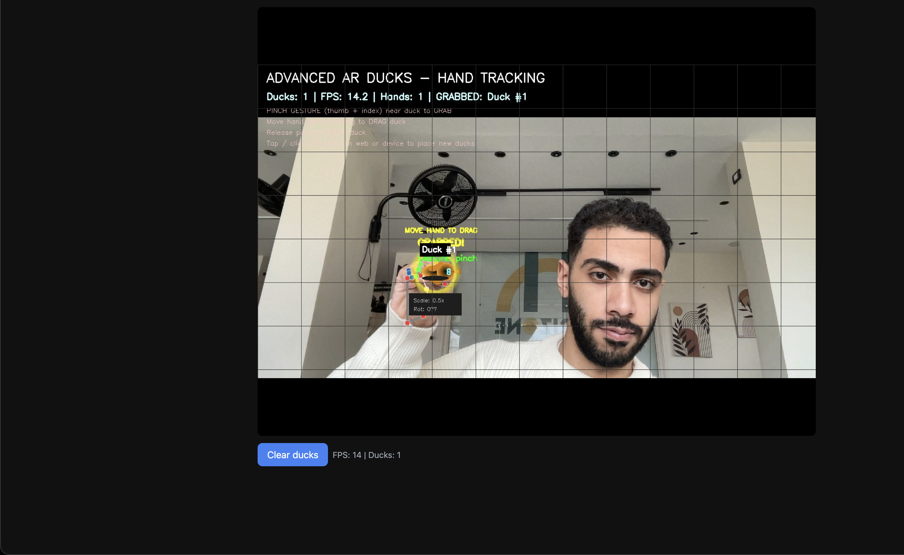

# Advanced AR Duck Server

This repository documents **Advanced AR Duck Server**, an augmented-reality style demo that combines **live webcam video**, **real-time hand tracking**, and **interactive “duck” objects** users can place, pinch-grab, and drag in the video frame. The system is implemented as a **Python Flask** application that serves both a **REST API** and a **mobile-friendly web viewer**, so the same backend can be used from a desktop browser, a phone on the same Wi-Fi network, or any HTTP client.

This GitHub repository is intentionally **documentation-only**: large binaries (3D assets, MediaPipe task models) and the **application source tree** are listed in `.gitignore` so clones stay small and Git LFS is not required. Obtain the runnable application, `mecha_duck.glb`, and dependency pins from your project maintainer or your private artifact store; this README describes how everything fits together once those files are present locally.

---

## Screenshots

Captured from the **web viewer** (`GET /`): live mirrored camera, MediaPipe hand skeleton, HUD (ducks count, FPS, gesture label), and the 2D duck overlay. Grid and instructions are composited in the video frame on the server.

**Open hand — landmark overlay and “Gesture: open”**



**Pinch — grab active (“GRABBED!”, “MOVE HAND TO DRAG”)**



Source files for these images live in [`docs/screenshots/`](docs/screenshots/) (`screenshot-01.png`, `screenshot-02.png`).

---

## Table of contents

1. [Screenshots](#screenshots)
2. [Goals and non-goals](#goals-and-non-goals)
3. [High-level architecture](#high-level-architecture)
4. [Technology stack](#technology-stack)
5. [Runtime components](#runtime-components)
6. [Data flow](#data-flow)
7. [Hand tracking pipeline](#hand-tracking-pipeline)
8. [Gesture semantics](#gesture-semantics)
9. [Duck objects and rendering](#duck-objects-and-rendering)
10. [Threading and concurrency](#threading-and-concurrency)
11. [Network API overview](#network-api-overview)
12. [HTTP routes reference](#http-routes-reference)
13. [Web viewer behavior](#web-viewer-behavior)
14. [Configuration and environment](#configuration-and-environment)
15. [Local files expected on disk](#local-files-expected-on-disk)
16. [Installation outline](#installation-outline)
17. [Starting the server](#starting-the-server)
18. [Accessing from another device](#accessing-from-another-device)
19. [Simulation mode](#simulation-mode)
20. [Performance considerations](#performance-considerations)
21. [Troubleshooting](#troubleshooting)
22. [Security and deployment notes](#security-and-deployment-notes)
23. [Version history and compatibility](#version-history-and-compatibility)
24. [Credits and references](#credits-and-references)

---

## Goals and non-goals

**Goals**

- Provide a **single-process** demo server that captures video, runs **hand landmark detection**, composites **2D duck graphics** and overlays, and exposes the result as **JPEG frames** in JSON for thin clients.
- Support **pinch-to-grab** interaction: when the user’s pinch is near a duck, that duck’s normalized position follows the hand until the user releases the pinch or tracking is lost.
- Offer a **zero-install viewer** on phones and desktops via a simple HTML page that polls the frame endpoint and sends tap events to place new ducks.
- Remain **easy to reason about** for workshops and CV/AR experiments: explicit routes, plain JSON, OpenCV-based drawing.

**Non-goals**

- This is **not** a production AR runtime (no ARCore/ARKit session, no SLAM, no true 3D occlusion in the physical world). Ducks are drawn in **image space** on top of the video.
- The **3D GLB** path is metadata for downstream clients; the reference server visualization is **2D OpenCV** art, not a GLB renderer.
- **End-to-end encrypted** or **authenticated** multi-user sessions are out of scope for the reference design.

---

## High-level architecture

At a glance, the system has three cooperating layers:

1. **Capture layer** — `OpenCV` `VideoCapture` reads frames from the default camera (or a synthetic loop if no camera is available).
2. **Perception layer** — **MediaPipe Tasks** `HandLandmarker` runs in **VIDEO** mode on each frame, producing up to two hands’ worth of normalized landmarks.
3. **Application layer** — A Flask app exposes JSON routes, maintains duck state, encodes the latest processed frame as base64 JPEG, and serves a small HTML shell for browsers.

A background thread owns the tight loop: read frame, mirror horizontally, run hand detection and gesture logic, draw ducks and HUD, then publish the result under a lock. HTTP handlers only read that buffer and serialize it, which keeps request latency predictable.

---

## Technology stack

| Area            | Choice              | Role |
|----------------|---------------------|------|
| Language       | Python 3            | Server and CV glue |
| Web framework  | Flask               | HTTP, CORS, JSON, HTML response |
| Video I/O      | OpenCV (`cv2`)      | Camera, flip, encode JPEG |
| Numerics       | NumPy               | Distances, smoothing buffers |
| Hand landmarks | MediaPipe Tasks     | `HandLandmarker` (.task model) |
| Packaging      | `venv` + `pip`      | Isolated dependencies |

---

## Runtime components

**`AdvancedARDuck` (core state machine)**  
Holds the list of duck objects, the next ID, optional `VideoCapture`, the latest frame, a re-entrant lock for frame access, FPS estimate, hand landmarker instance (or `None` if initialization failed), pinch state (`grabbed_duck_id`, timestamps), and a short history of hand positions for smoothing.

**Flask application**  
Single global `server` instance constructed at import time. Routes are thin wrappers: they validate input, call `server` methods, and return `jsonify` or `Response`.

**Web viewer**  
Embedded multi-line HTML string returned from `GET /`, with inline CSS and JavaScript. It uses `fetch` on a timer to pull `/camera/frame` and sets an `` `src` to a `data:image/jpeg;base64,...` URL.

---

## Data flow

1. Camera thread reads **BGR** frame.
2. Frame is **flipped horizontally** so the image matches a mirror (natural for selfie-style interaction).
3. **RGB** copy is passed to **HandLandmarker** with a monotonically increasing timestamp in milliseconds (video mode requirement).
4. For each detected hand, the server derives **pixel-space pinch distance** between thumb tip and index tip and classifies **pinch**, **open**, or **fist**.
5. If pinching and no duck is grabbed, the server searches existing ducks for one whose normalized position is within a **proximity threshold** of the index-based grab point.
6. If pinching and a duck is already grabbed, the duck’s `position.x` and `position.y` are updated to the smoothed hand position (normalized 0–1).
7. All ducks are drawn with **OpenCV** primitives (ellipses, polygons, text).
8. A **HUD** (title, duck count, FPS, hand count, instructions) is drawn at the top.
9. The composed frame is stored; HTTP clients request it as **JPEG base64** inside JSON.

---

## Hand tracking pipeline

MediaPipe **0.10+** removed the legacy `mediapipe.solutions` API in many distributions. The reference server uses the **Tasks** vision stack:

- A **`hand_landmarker.task`** file is stored under a `models/` directory next to the application.
- On first run, if the file is missing, the server can **download** it from Google’s public model bucket (URL is constants in source).
- `HandLandmarkerOptions` uses **`VisionTaskRunningMode.VIDEO`**, which requires **`detect_for_video(image, timestamp_ms)`** with strictly increasing timestamps.
- Up to **two hands** are configured, with elevated confidence thresholds for more stable tracking in good lighting.

Landmark indices follow the MediaPipe hand model: **wrist (0)**, **thumb tip (4)**, **index tip (8)**, through **pinky tip (20)**. The pinch metric uses **pixel distance** after scaling normalized coordinates by frame width and height, compared to a tuned threshold (on the order of tens of pixels at 720p).

---

## Gesture semantics

- **Pinch** — Thumb tip and index tip are closer than the pinch threshold. Used for **grab** and **drag** when near a duck.
- **Open** — Average fingertip spread relative to the wrist is large. Pinch logic is not active; any held duck is **released** when transitioning out of pinch (depending on implementation details of “no hand” vs “open hand”).
- **Fist** — Fingers are relatively contracted; treated as not pinching for grab purposes in the same branch as open vs pinch classification.

Smoothing: a short FIFO of recent primary-hand positions is averaged to reduce jitter during drag.

---

## Duck objects and rendering

Each duck is a dictionary-like structure with:

- **`id`**: monotonic integer key.
- **`position`**: `x`, `y` in **normalized** coordinates (0–1), `z` placeholder.
- **`rotation`**: Euler-style dict; the server primarily uses **`rotation.y`** for 2D orientation of the drawn duck.
- **`scale`**: multiplier for base drawing size.
- **`model`**: path string pointing at **`mecha_duck.glb`** when present (informative for GLB-aware clients).
- **`timestamp`**: last update time.

Rendering overlays **body**, **head**, **beak**, **eyes**, **wings**, **shadow**, optional **grab halo**, and **labels** (IDs, scale, rotation). Colors are BGR tuples suitable for OpenCV.

---

## Threading and concurrency

- **`threading.Lock`** protects **`current_frame`** (and consistent reads alongside metadata if needed).
- The **camera loop** (or simulation loop) runs in a **daemon thread** so Flask’s main thread can serve HTTP.
- **`is_running`** gates the loops; **start/stop** routes flip this flag (whether the capture thread exits immediately depends on loop structure; production code may join threads cleanly).

---

## Network API overview

All JSON routes use **UTF-8** JSON bodies where applicable. **CORS** is enabled globally for browser access from arbitrary origins in the reference app—adjust for production.

Typical clients:

- **Web viewer** — `GET /`, `GET /camera/frame`, `POST /ar/tap`, `POST /objects/clear`.
- **Diagnostics** — `GET /api/status`.
- **Integrations** — `GET /objects`, `POST /object/:id/update`, `DELETE /object/:id`.

---

## HTTP routes reference

### `GET /`

Returns **`text/html`** for the bundled **web viewer**. This page includes a responsive layout, a live image element, a short status line (FPS and duck count derived from the last successful frame response), tap-to-place behavior mapped to normalized coordinates, and a button that clears all ducks.

### `GET /api/status`

Returns **JSON** summarizing service health:

- **`status`**: `"running"` when the process is up.
- **`service`** / **`version`**: human-readable identifiers.
- **`features`**: capability tags (hand tracking, pinch, web viewer, etc.).
- **`model`**: path string for the GLB asset if configured.
- **`ducks_count`**: number of active ducks.
- **`grabbed_duck_id`**: current grab target or `null`.
- **`camera`**: boolean—whether an **opened** `VideoCapture` is active.
- **`mode`**: `"Live Camera"` vs `"Simulation"` string for operators.
- **`fps`**: floating estimate from the processing loop.
- **`hand_tracking`**: whether the MediaPipe landmarker initialized.

### `GET /camera/frame`

Returns **JSON** with:

- **`success`**: boolean.
- **`frame`**: base64-encoded **JPEG** string of the latest composed image (or a placeholder while initializing).
- **`objects`**: serialized duck list.
- **`grabbed_duck_id`**: optional int or null.
- **`fps`**, **`timestamp`**, **`resolution`**: diagnostic fields.

Clients should decode base64 to binary JPEG or use a `data:` URL.

### `POST /ar/start` and `POST /ar/stop`

Toggle **`is_running`** for coarse session control. Useful for integrating external lifecycle managers.

### `POST /ar/tap`

**Places** a new duck. JSON body fields:

- **`x`**, **`y`**: normalized position (defaults ~0.5).
- **`scale`**: optional float.
- **`rotation`**: optional object with **`y`** in radians or degrees consistent with server expectations (source uses **`rotation['y']`**).

Response includes **`success`**, **`duck`** object, and a message string.

### `POST /object/<id>/update`

Updates **`scale`** and/or **`rotation.y`** for an existing duck. Partial updates are typical.

### `DELETE /object/<id>`

Removes a duck by ID and clears grab state if that duck was held.

### `GET /objects`

Returns the full **`objects`** array for synchronization or debugging.

### `POST /objects/clear`

Removes **all** ducks and resets grab state. Response includes cleared count.

---

## Web viewer behavior

The HTML shell is **self-contained** (no external JS CDN required for basic operation). It repeatedly calls `fetch('/camera/frame')` on an interval on the order of tens of milliseconds. Each successful payload refreshes the bitmap shown to the user.

**Tap / click** on the image computes normalized `(x, y)` based on the **displayed** image bounding rectangle so that placement aligns with the video even when the image is letterboxed via `object-fit`.

**Touch** `touchend` handlers **`preventDefault`** to reduce double-firing with click on some browsers; this improves mobile behavior at the cost of needing careful UX on scrollable pages (here the page is essentially fixed).

**Clear** sends `POST /objects/clear`.

Because the viewer uses **relative** paths (`/camera/frame`, etc.), it works when served from the same host and port as the API—which is exactly how Flask hosts it. For reverse proxies, ensure path routing keeps these endpoints consistent.

---

## Configuration and environment

- **`PORT`** environment variable selects the listen port. The reference default avoids macOS **AirPlay Receiver** conflicts on **5000** by preferring **5050**; set `PORT` explicitly when integrating with `docker-compose` or systemd socket units.
- **Host binding** is `0.0.0.0` in the reference main block so **phones** on the LAN can connect; tighten to `127.0.0.1` in untrusted networks.

---

## Local files expected on disk

When you run the full application outside this slim GitHub tree, you will normally have:

1. **`main.py`** (or equivalent package) — Flask app and CV loop.
2. **`requirements.txt`** — pinned or minimum versions for Flask, `opencv-python-headless`, NumPy, `mediapipe`, `flask-cors`.
3. **`models/hand_landmarker.task`** — either downloaded automatically or copied from an internal mirror.
4. **`mecha_duck.glb`** — optional; server logs a warning and continues with purely 2D art if missing. Place **`assets/3d/mecha_duck.glb`** as an alternative layout supported by the loader.

These files are **gitignored here** to avoid committing tens of megabytes per clone.

---

## Installation outline

1. Install **Python 3.10+** (exact floor depends on wheels available for your OS/architecture).
2. Create a **virtual environment** in the project directory.
3. **`pip install -r requirements.txt`** using the file from your private bundle.
4. Ensure **camera permissions** are granted on macOS (Security & Privacy → Camera) and that no other app monopolizes the device.

---

## Starting the server

From the directory containing `main.py`:

```bash
source .venv/bin/activate
python main.py
```

Observe the printed **LAN URL** and open it from a phone browser for the full experience.

---

## Accessing from another device

Requirements:

- Phone and laptop on the **same subnet** (or VPN).
- **Firewall** allows inbound TCP on the chosen port.
- You browse to **`http://<laptop-lan-ip>:<port>/`**, not `localhost` on the phone.

If connection fails, verify with `ping`, `nc -vz host port`, and Flask logs.

---

## Simulation mode

If **`VideoCapture(0)`** cannot be opened, the server falls back to a **synthetic background** loop: dark grid, center marker, and ducks—**without** live hand tracking on a camera stream. This mode is useful for CI smoke tests or headless demos where interaction is API-driven only.

---

## Performance considerations

- **Resolution** is configured toward **1280×720** with a high target FPS, but actual throughput depends on CPU, XNNPACK delegate messages, and OpenCV overhead.
- **JPEG quality** is set high for visual fidelity at the cost of bandwidth; mobile viewers may feel network-bound before CPU-bound on slow Wi-Fi.
- **Polling** the frame endpoint every 50 ms can mean **20 FPS ceiling** regardless of camera FPS unless clients implement adaptive backoff.

---

## Troubleshooting

**Port already in use**  
Change **`PORT`** or stop conflicting services (e.g. macOS Control Center on **5000**).

**No camera**  
Check permissions, close other apps using the camera, try different `VideoCapture` indices in source if you have multiple devices.

**Hand landmarker fails**  
Confirm the **`.task`** file downloaded completely, disk is writable, and MediaPipe version matches the Tasks API.

**Blank or stale image in browser**  
Open dev tools → Network; confirm **`/camera/frame`** returns **`success: true`** and non-empty **`frame`**. Mixed-content issues only apply if you mistakenly serve HTTPS frontend against HTTP API with restrictive policies.

**Pinch never grabs**  
Tune pinch pixel threshold and duck proximity threshold for your camera FOV and arm distance; lighting drastically affects landmark stability.

---

## Security and deployment notes

The reference server is a **development** Flask process:

- **Do not expose it directly to the public internet** without authentication, HTTPS termination, rate limiting, and hardened headers.
- **CORS * allows** any origin is convenient for class demos and dangerous for production.
- **Input validation** on JSON routes should be hardened if exposed beyond trusted LANs.

For production-style deployments, place **gunicorn** or **uwsgi** behind **nginx**, serve TLS, and restrict admin endpoints.

---

## Version history and compatibility

- **2.x** — Migrates hand tracking to **MediaPipe Tasks** `HandLandmarker` with explicit `.task` model and **VIDEO** running mode; adds web viewer at `/` and JSON status at `/api/status`; adjusts default port away from **5000** on developer Macs.
- Earlier experiments may have used **`mediapipe.solutions.hands`**, which is incompatible with some modern wheels—always match documentation to your installed **`mediapipe`** major/minor.

---

## Credits and references

- **MediaPipe** hand landmark model and Tasks API — Google AI Edge / MediaPipe project.
- **Flask** — Pallets project.
- **OpenCV** — camera capture and drawing primitives.

---

## Appendix A: Example JSON snippets

**Status**

```json
{
  "status": "running",
  "camera": true,
  "mode": "Live Camera",
  "hand_tracking": true,
  "ducks_count": 2,
  "fps": 24.5
}
```

**Tap response**

```json
{
  "success": true,
  "duck": {
    "id": 3,
    "position": { "x": 0.4, "y": 0.55, "z": 0 },
    "rotation": { "x": 0, "y": 0.0, "z": 0 },
    "scale": 0.5
  }
}
```

---

## Appendix B: Mental model for integrators

Think of this server as a **“shared Photoshop document”** living in RAM: each HTTP `GET /camera/frame` returns a raster snapshot of that canvas; `POST /ar/tap` adds a layer (duck); pinch gestures move layers when the perception thread agrees you are grabbing near them. There is **no** persistent world model beyond the in-memory object list and whatever your clients cache from JSON.

---

## Appendix C: Why this repository stays small

Educational and portfolio repositories often balloon when **multi-megabyte** assets and virtualenvs are accidentally committed. By **ignoring** `*.glb`, **`models/*.task`**, **`*.py`**, and **`requirements.txt`** at the Git layer (for this public documentation fork), we guarantee `git clone` remains fast and GitHub’s UI remains responsive. Your team’s **private monorepo** or **release zip** remains the source of truth for runnable artifacts.

---

## Appendix D: Suggested private bundle layout

When distributing the runnable app internally, package:

```
advanced-ar-duck/
  main.py
  requirements.txt
  mecha_duck.glb          # optional visual asset
  models/
    hand_landmarker.task  # optional; can be auto-fetched
  README.md               # can symlink to this documentation
```

Verify checksums of binaries in your software bill of materials if compliance matters.

---

## Appendix E: Future improvements

- WebSocket or **MJPEG** stream to cut JSON+base64 overhead.
- **TLS** + **device pairing** QR codes for safer LAN onboarding.
- Optional **GPU** backends where OpenCV and delegates permit.
- Unit tests for geometry helpers (pinch threshold, smoothing).

---

## Appendix F: Contact and contributions

Because the **code** is intentionally omitted from this public mirror, open **issues** here should focus on **documentation corrections**, **API clarifications**, and **educational feedback**. Source-level merge requests belong in your private development repository.

---

## Appendix G: Glossary

- **Normalized coordinates** — Fractions of image width/height, independent of resolution, for duck positions.
- **Tasks API** — MediaPipe’s post-0.10 configuration-driven inference surface distinct from the legacy Solutions API.
- **VIDEO mode** — Requires monotonic frame timestamps and `detect_for_video`.
- **Pinch threshold** — Pixel-space cutoff declaring thumb and index “touching” for grab intent.

---

## Appendix H: Long-form UX walkthrough

1. Operator starts the Flask process on a laptop with a working webcam.
2. Operator opens **`/`** locally to confirm the feed is live.
3. Operator shares the **LAN URL** with participants.
4. Participant loads the page; sees mirrored video with HUD text.
5. Participant **taps** the image; a new duck appears near that locus in **image space**.
6. Participant steps into frame; landmarks render as skeleton overlay when tracking succeeds.
7. Participant **pinches** near a duck; duck highlights as grabbed.
8. Participant translates hand while pinching; duck follows (with smoothing).
9. Participant releases pinch; duck stays at the last position until moved again or cleared.

This walkthrough matches the intended classroom story even if exact colors and labels evolve in your private branch.

---

*End of README — Advanced AR Duck Server documentation mirror.*
